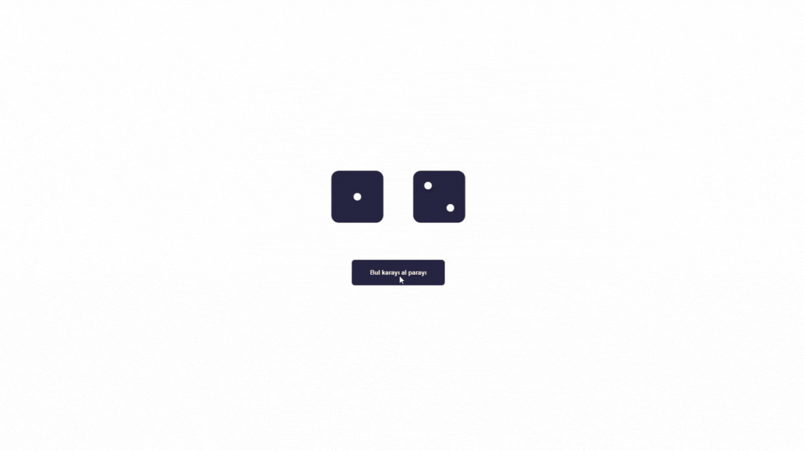

# 🎲 Dice Game

<h2>This project is designed as an interactive dice game, built with the React library.</h2>

# 🛠️ Technologies Used

<h3><b>React:</b> For building the user interface and managing component states.</h3>
<h3><b>JS:</b> For adding functionality and making the game dynamic.</h3>
<h3><b>CSS:</b> For styling and making the design user-friendly.</h3>

# 🎮 Game Overview

<h2>The Dice Game lets users roll two different dice, each generating a new random value with every command. By clicking the button, both dice will roll, and a random value will be assigned to each dice. The outcome of the roll is displayed instantly, providing an engaging and entertaining experience.</h2>

# Key Features

<h3><b>🎲 Interactive Dice Roll:</b> Click a button to roll two dice and display new random values.</h3>

<h3><b>🔄 Random Outcomes:</b> Each dice receives a random value every time it is rolled, ensuring unique results with every roll.</h3>

<h3><b>💻 React Functional Components:</b> The game is built using functional components in React, allowing for a clean, organized codebase.</h3>

<h3><b>📱 Responsive Design:</b> The game is styled to be user-friendly and works well on different screen sizes.</h3>

## 🚀 Live Demo

